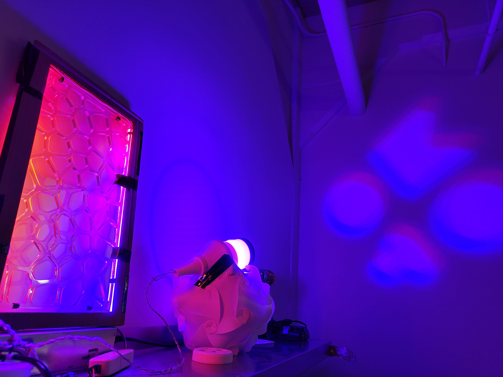

# PDF Database (cooler title here)

<!-- link to actual site https://conradbuck.github.io/simple-link-tree/ -->

Welcome to the PDF Database! Here is a collection of pictures and pdfs.

  

    <a href="documents/document1.pdf" target="_blank">    <!--## file location of pdf in github repo ##-->
       <!--## file location of preview image within github repo ##-->
      
Cool stuff about Ni-20Cr machining
		  <!--## name of hyperlink ##-->
    </a>
  

  

    <a href="https://again.framer.ai/" target="_blank">
      
      
Link to external webpage about my lights

    </a>
  

  

    <a href="https://forms.gle/uWzb2qyrie8GGCes7" target="_blank">
      
      
Join our mailing list (google forms link)

    </a>
  

  

    <a href="https://drive.google.com/file/d/1mzleKG7kpYIQpbF11vh0I8zP9OhVkrVN/view?usp=sharing" target="_blank">
      
      
Link to document on google drive

    </a>
  

  

    <a href="https://cdn-shop.adafruit.com/datasheets/WS2811.pdf" target="_blank">
      
      
Link to pdf on random website

    </a>
  

<!-- commenting out image placement 6 to leave as references -->
<!--
  

    <a href="documents/document6.pdf" target="_blank">
      
      
Topic 6

    </a>
  

-->

<!--

### Instructions for Contribution
1. Add your PDF document to the `documents` directory.
2. Add a preview image to the `images` directory.
3. Update this `README.md` file to include your new document and image in the format above.

-->
